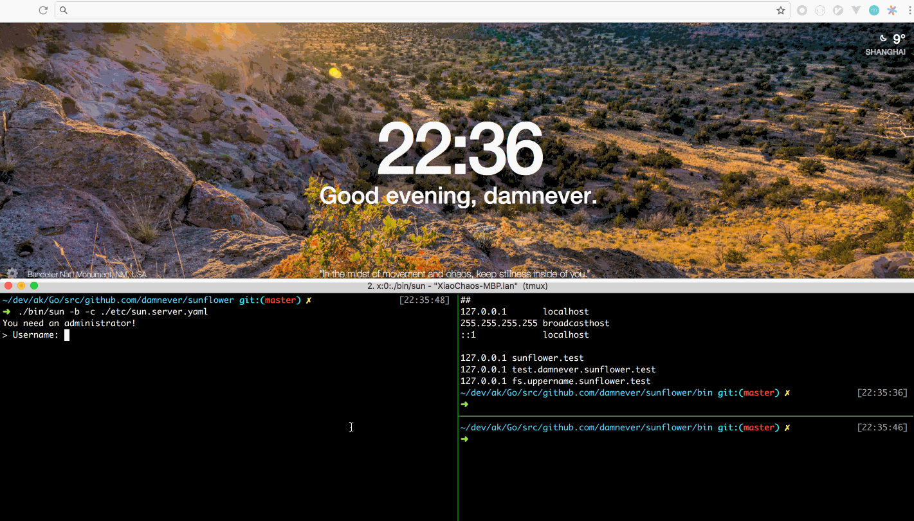

## The most easy way to export your local port.

**NOTE**:

- It is intend for personal use, code is dirty but works :)
- There is no plan to support UDP.
- You can use TCP to support the high level protocols those built on top of TCP, HTTP/1.x is a special case.
- Only one connection per tunnel, don't worry, it works fine(I have been using it for months)..
- Server side cross-platform compilation is not working, also build it on Windows may have problems..
- There are too many TODOs and balabala.. (anyway, I don't need it..)

### Quick Start



```
$ go get github.com/damnever/sunflower/cmd/sun/...
$ cd `go list -e -f '{{.Dir}}' github.com/damnever/sunflower`
$ sun -b -c etc/sun.server.yaml
```

NOTE: `go` environment is required, if you want to deploy it.

### LICENSE

[The BSD 3-Clause License](https://github.com/damnever/sunflower/blob/master/LICENSE)
